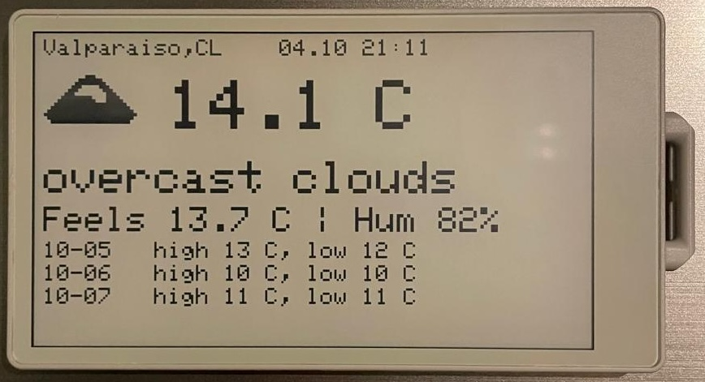

# 🧭 M5Stack PaperS3 Weather Display

A minimalist e‑ink weather dashboard for the **M5Stack PaperS3**.  
Fetches the current weather and a 3‑day forecast from **OpenWeatherMap**, draws simple built‑in monochrome icons, and updates on a configurable schedule using deep sleep for power efficiency.

---

## ✨ Features

- 🌦 Current temperature, humidity, and description  
- 📅 3‑day forecast (high / low per day)  
- 🖼 Built‑in 1‑bit icons for sun, clouds, rain, thunder, snow, and mist  
- ⏰ Automatic NTP time synchronization  
- 🔋 Deep‑sleep refresh cycle (default = 60 minutes)  
- 🧱 No external storage or network portal required  

---

## 🧩 Hardware / Software Requirements

| Component | Version / Notes |
|------------|----------------|
| **M5Stack PaperS3** | ESP32‑S3 e‑ink device |
| **Arduino IDE** | ≥ 2.0 or PlatformIO |
| **ESP32 Boards package** | ≥ 2.0.14 |
| **Libraries** | `M5Unified`, `ArduinoJson`, `WiFi` |

---

## ⚙️ Setup Guide

### 1️⃣ Install Environment
1. In *File → Preferences*, add  
   `https://static-cdn.m5stack.com/resource/arduino/package_m5stack_index.json`
2. Install **ESP32** boards in *Tools → Board Manager*.
3. Install libraries:  
   `M5Unified`, `ArduinoJson`.

### 2️⃣ Board Settings
- **Board:** *M5Stack PaperS3* (or *ESP32‑S3 Dev Module*)  
- **Flash Size:** 16 MB  
- **Partition Scheme:** 16M (2.5MP APP / 12.5MP FATFS)
- **USB Mode:** CDC and JTAG  
- **Upload Speed:** 921 600

### 3️⃣ Configuration
Edit the top of the sketch to set your credentials and preferences:
```cpp
const char* ssid     = "YourWiFi";
const char* password = "YourPassword";
const char* city     = "Valparaiso,CL";
const char* apiKey   = "YOUR_OPENWEATHERMAP_KEY";
const char* units    = "metric";
bool useDeepSleep    = true;
int  sleepMinutes    = 60;
```

### 4️⃣ Upload & Run
- Flash the code.  
- The device connects to Wi‑Fi, syncs time, fetches data, and renders the display.  
- After drawing, it sleeps for the configured interval and wakes automatically.
- Button press will restart and reload current weather information.

---

## 🧮 Configuration Variables

| Variable | Purpose | Default |
|-----------|----------|----------|
| `city` | Weather location | `"Valparaiso,CL"` |
| `apiKey` | OpenWeatherMap API key | *(replace with your key)* |
| `units` | `"metric"` or `"imperial"` | `"metric"` |
| `sleepMinutes` | Refresh interval (min) | `60` |
| `useDeepSleep` | Enable power saving mode | `true` |

---

## 🌅 Displayed Information

| Section | Source | Example |
|----------|---------|----------|
| Current weather | `/data/2.5/weather` | “Temp 18.4 °C Feels 17.2 °C Clouds” |
| Forecast (3 days) | `/data/2.5/forecast` | “10‑04 high 19 °C low 12 °C” |
| Time stamp | NTP (localtime) | “Updated 04.10 10:00” |

---

## 🩹 Troubleshooting

| Symptom | Likely Cause | Fix |
|----------|--------------|-----|
| “Fetch failed.” | Bad Wi‑Fi or API key | Check credentials and key |
| Wrong time | NTP offset incorrect | Adjust `gmtOffset_sec` and `daylightOffset_sec` |
| Frequent reboots | Wi‑Fi timeout | Move closer to router or increase timeout |

---

## 🧠 Implementation Notes

- Uses **OpenWeatherMap REST API** via `HTTPClient`.  
- Parses JSON with **ArduinoJson**.  
- Icons are hard‑coded 64×16 1‑bit bitmaps drawn directly from `PROGMEM`.  
- The display is cleared and redrawn entirely each cycle.  
- Deep sleep is handled with `esp_sleep_enable_timer_wakeup()`.

---

## 📜 License

MIT © 2025.

---

## 📸 Screenshot


